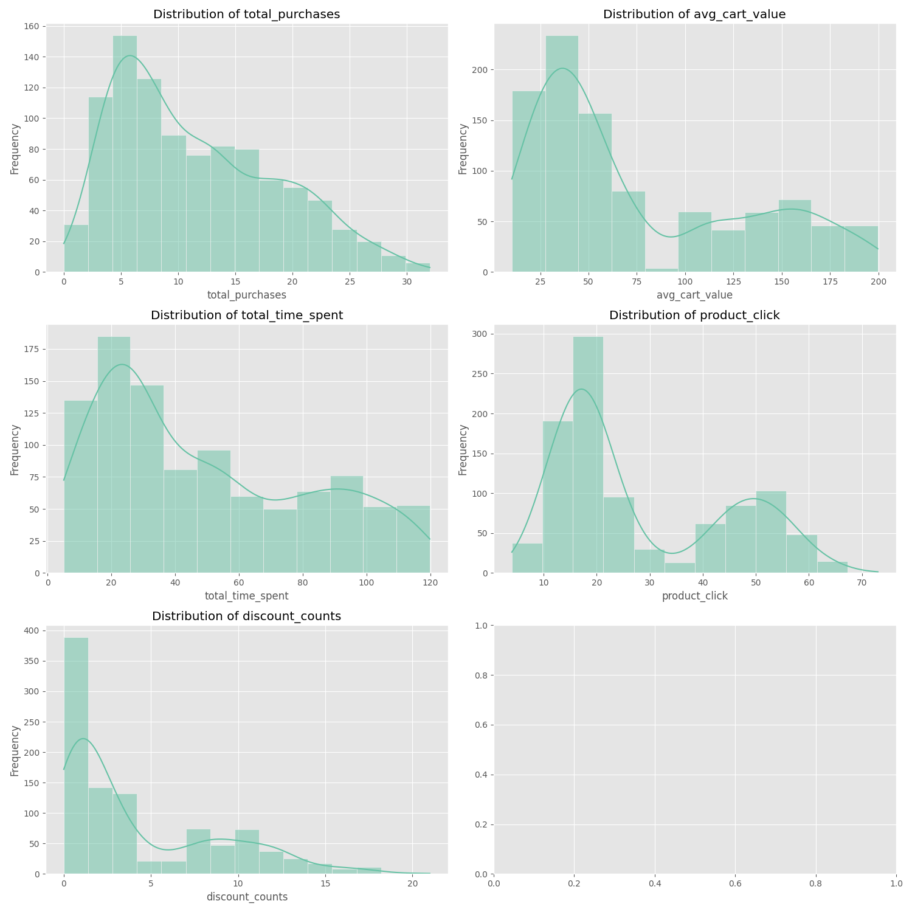
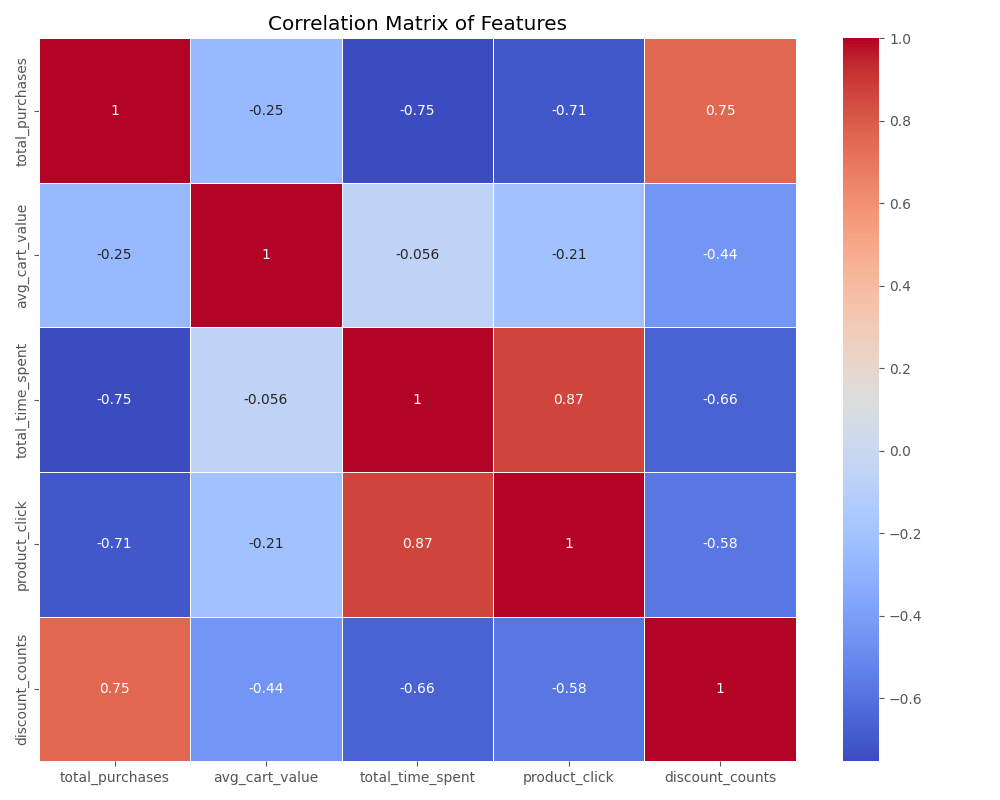
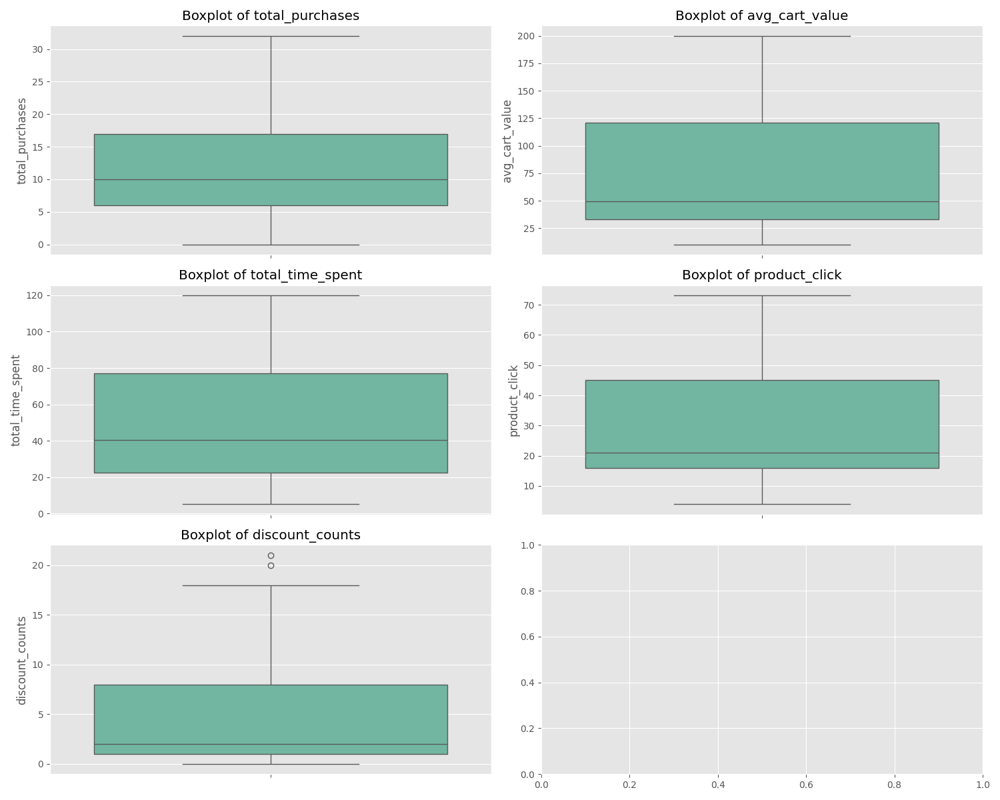
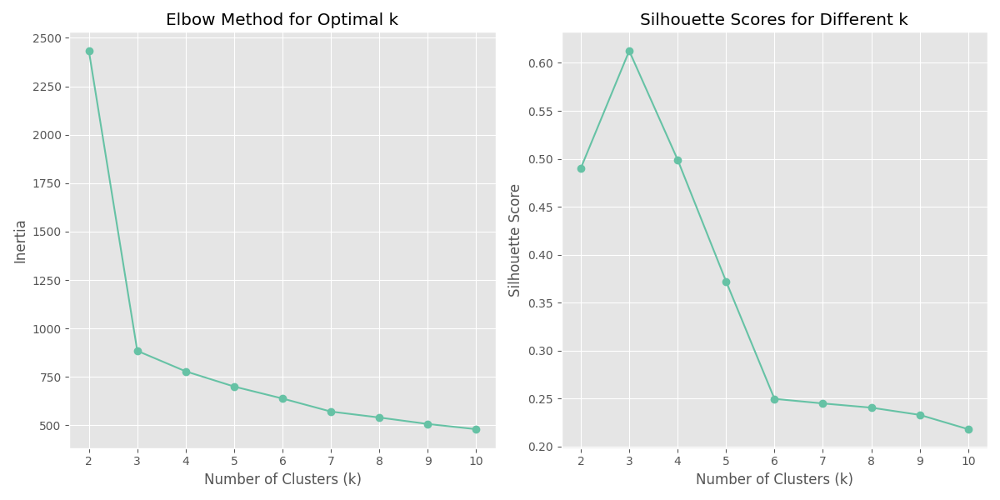
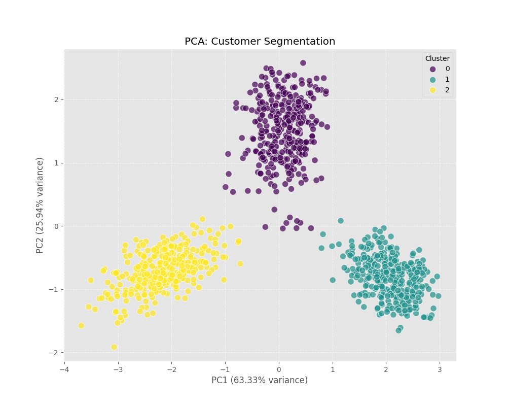
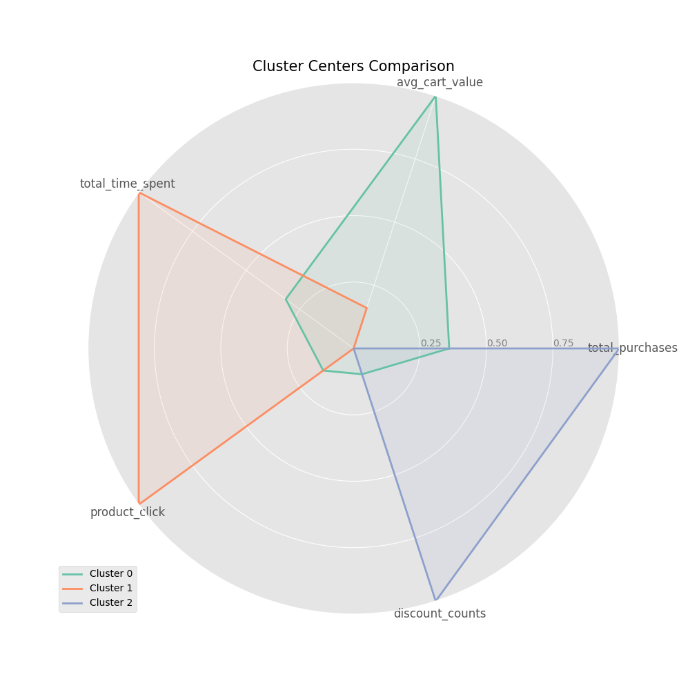
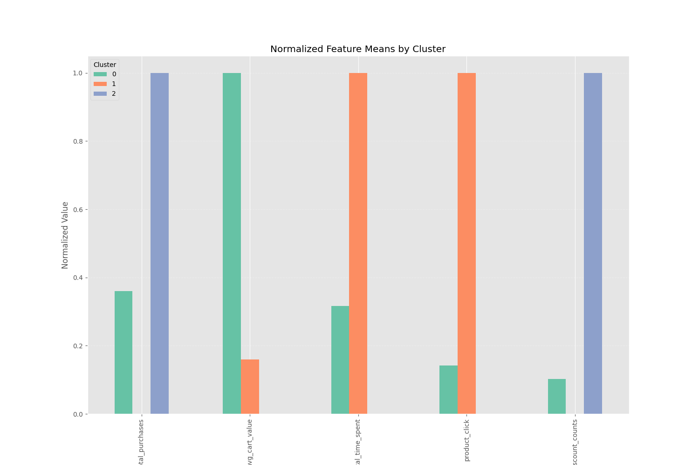
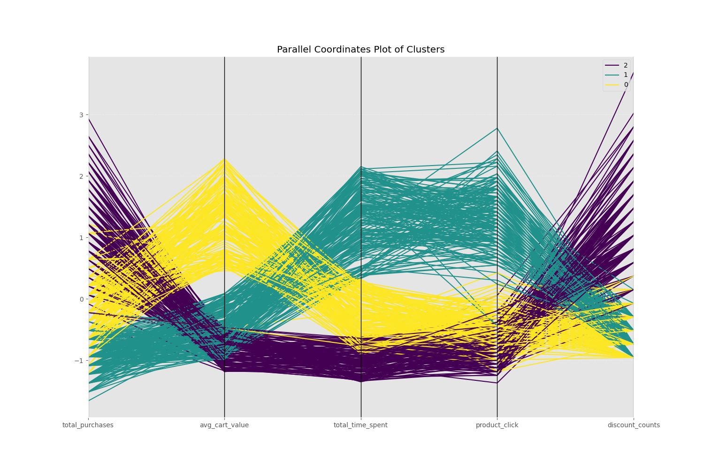
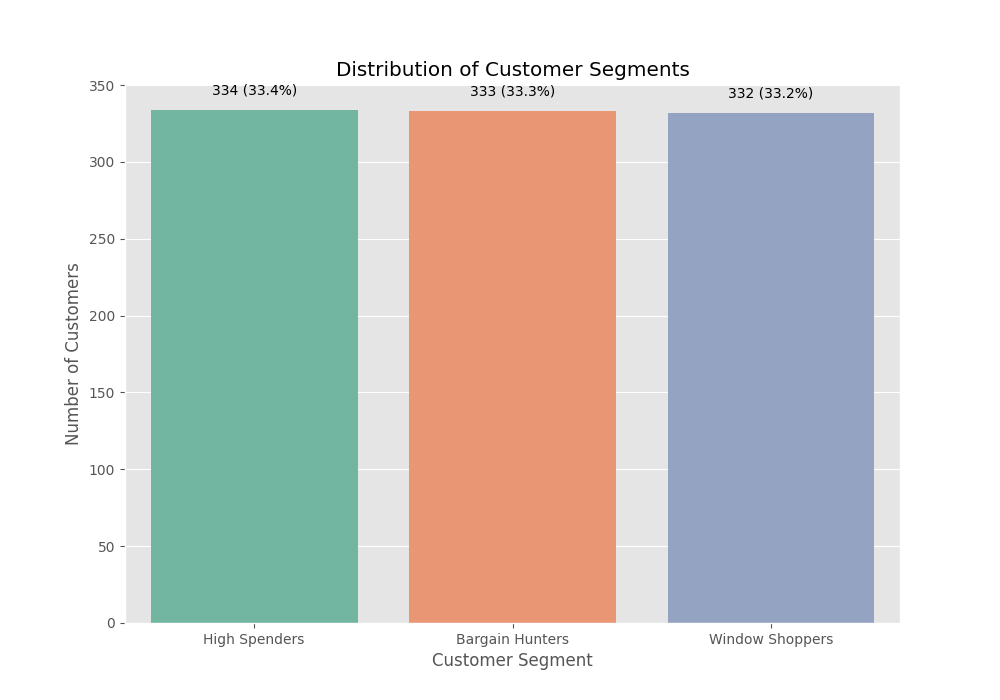
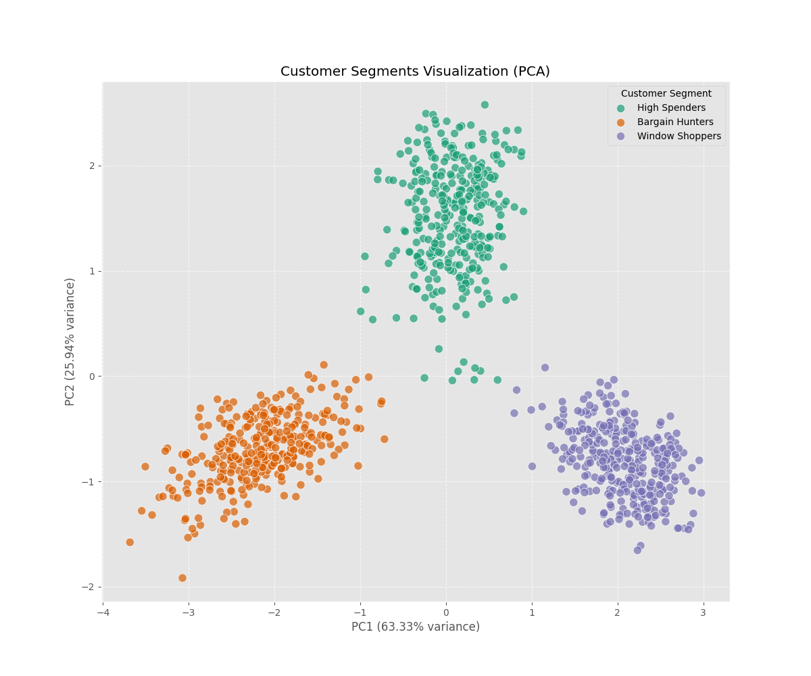

# Customer Segmentation Analysis
## E-commerce Platform Customer Behavior

### Executive Summary

This report presents an analysis of customer segmentation for an e-commerce platform based on customer behavior data. The analysis successfully identified three distinct customer segments as specified in the assignment: Bargain Hunters, High Spenders, and Window Shoppers. Using unsupervised machine learning techniques, specifically K-means clustering, we were able to differentiate these customer groups based on their purchasing patterns, browsing behaviors, and discount usage.

The identified segments align well with the expected characteristics:
- **Bargain Hunters**: Frequent purchases of low-value items with high discount usage
- **High Spenders**: Fewer but high-value purchases with low discount usage
- **Window Shoppers**: Very few purchases despite high browsing time and product views

This segmentation provides valuable insights for targeted marketing strategies, personalized customer experiences, and business decision-making.

### Table of Contents

1. [Introduction](#introduction)
2. [Data Overview](#data-overview)
3. [Exploratory Data Analysis](#exploratory-data-analysis)
4. [Data Preprocessing](#data-preprocessing)
5. [Model Selection](#model-selection)
6. [Model Evaluation](#model-evaluation)
7. [Cluster Analysis and Interpretation](#cluster-analysis-and-interpretation)
8. [Segment Identification](#segment-identification)
9. [Recommendations](#recommendations)
10. [Conclusion](#conclusion)

### 1. Introduction <a name="introduction"></a>

Customer segmentation is a strategic approach to divide a customer base into groups of individuals with similar characteristics, behaviors, or preferences. For an e-commerce platform, effective segmentation enables personalized marketing, improved customer experiences, and optimized business strategies.

This analysis aims to identify three specific customer segments based on their behaviors:
1. Bargain Hunters
2. High Spenders
3. Window Shoppers

Each segment represents a distinct customer profile with unique characteristics and purchasing behaviors. Identifying these segments will allow the e-commerce platform to develop targeted strategies to maximize customer satisfaction and business value.

### 2. Data Overview <a name="data-overview"></a>

The dataset contains information about customer behavior on an e-commerce platform. It includes 999 customer records with 6 features:

- **customer_id**: Unique identifier for each customer
- **total_purchases**: Total number of purchases made by the customer
- **avg_cart_value**: Average value of items in the customer's cart
- **total_time_spent**: Total time spent on the platform (in minutes)
- **product_click**: Number of products viewed by the customer
- **discount_counts**: Number of times the customer used a discount code

The analysis focuses on identifying patterns in these behavioral features to segment customers into the three predefined groups.

#### Initial Data Summary

All features of the dataset are numerical, providing a solid foundation for clustering analysis. There are 999 unique customers in the dataset, ensuring a substantial sample size for identifying meaningful segments. However, total_purchases, avg_cart_value, product_click data has count of 979 data. Which means 20 data is missing in those features.

### 3. Exploratory Data Analysis <a name="exploratory-data-analysis"></a>

Exploratory Data Analysis (EDA) was conducted to understand the distribution and relationships between the features.

#### Feature Distributions



The feature distributions reveal several interesting patterns:
- **total_purchases**: Shows a right-skewed distribution, suggesting most customers have lower total purchases values, while a few have significantly higher values.
- **avg_cart_value**: Exhibits a right-skewed distribution but the range 75-100 has dropped significantly. As the total purchases this indicates that most customers have lower average cart values, while a few have significantly higher values.
- **total_time_spent**: Displays a relatively normal distribution with potential clusters.
- **product_click**: Shows a multi-modal distribution, suggesting varying levels of browsing engagement.
- **discount_counts**: Indicates distinct patterns in discount usage, with some customers rarely using discounts and others using them frequently.

These distributions support the hypothesis of distinct customer segments with different behavioral patterns.

#### Correlation Analysis



The correlation matrix reveals several significant relationships:
- **product_click** and **total_time_spent** show a strong positive correlation (0.87), which is expected as customers who spend more time on the platform tend to view more products.
- **total_purchases** and **discount_counts** have a moderate positive correlation (0.75), suggesting that customers who make more purchases also tend to use more discount codes.
- **avg_cart_value** has a weak negative correlation with **product_click** (-0.21), indicating that customers who spend more per cart tend to click on products less.

These correlations align with the expected characteristics of the three customer segments and provide initial insights into their behavioral patterns.

#### Outlier Analysis



The boxplots reveal some outliers `discount_counts`. However, these outliers likely represent genuine extreme behaviors rather than data errors. Since we are interested in identifying distinct customer segments, including these outliers is valuable for capturing the full spectrum of customer behaviors.

### 4. Data Preprocessing <a name="data-preprocessing"></a>

Before applying clustering algorithms, the data was preprocessed to ensure optimal results:

1. **Feature Selection**: All behavioral features (total_purchases, avg_cart_value, total_time_spent, product_click, discount_counts) were retained for clustering, as they all contribute to customer segment identification.

2. **Standardization**: The features were standardized to have a mean of 0 and a standard deviation of 1. This step is crucial for K-means clustering, as it ensures that all features contribute equally to the distance calculations regardless of their original scales.

```python
scaler = StandardScaler()
X_scaled = scaler.fit_transform(X)
```

Standardization prevented features with larger scales (like total_time_spent) from dominating the clustering process, ensuring a balanced contribution from all behavioral attributes.

### 5. Model Selection <a name="model-selection"></a>

For this customer segmentation task, the K-means clustering algorithm was selected due to its efficiency, simplicity, and effectiveness for identifying distinct groups in behavioral data.

#### Determining the Optimal Number of Clusters

Although the assignment specified three customer segments, we validated this number using standard techniques:



1. **Elbow Method**: The plot of inertia (sum of squared distances from each point to its assigned center) shows a noticeable "elbow" at k=3, suggesting that this is indeed an optimal number of clusters.

2. **Silhouette Score**: The silhouette score measures how similar an object is to its own cluster compared to other clusters. The plot shows a peak at k=3, further confirming that three clusters provide the best separation of the data.

Based on both domain knowledge (the predefined customer segments) and these validation techniques, we proceeded with k=3 for the K-means clustering.

```python
kmeans = KMeans(n_clusters=3, random_state=42, n_init=10)
clusters = kmeans.fit_predict(X_scaled)
```

### 6. Model Evaluation <a name="model-evaluation"></a>

The clustering model was evaluated using multiple approaches:

#### Silhouette Score

The silhouette score for the 3-cluster solution was calculated as 0.6125, indicating a good separation between clusters. A silhouette score above 0.5 is generally considered to show a reasonable structure in the data.

#### Principal Component Analysis (PCA)

To visualize the clusters in a two-dimensional space, Principal Component Analysis (PCA) was applied:



The PCA visualization shows well-separated clusters, confirming that the K-means algorithm has successfully identified distinct groups of customers. The first two principal components explain approximately 63% of the variance in the data, providing a reliable representation of the customer segments.

### 7. Cluster Analysis and Interpretation <a name="cluster-analysis-and-interpretation"></a>

#### Cluster Centers

The cluster centers represent the average behavior of customers in each segment:

| Feature | Cluster 0 | Cluster 1 | Cluster 2 |
|---------|-----------|-----------|-----------|
| total_purchases | 10.17 | 4.92 | 19.5 |
| avg_cart_value | 144.68 | 49.03 | 30.798 |
| total_time_spent | 40.47 | 90.21 | 17.511 |
| product_click | 19.92 | 49.37 | 15.07 |
| discount_counts | 1.94 | 1.02 | 9.969 |

#### Radar Chart of Cluster Characteristics



The radar chart provides a clear visualization of how each cluster differs across the five behavioral features. The distinct patterns align well with the expected characteristics of the three customer segments:

- **Cluster 0**: High avg_cart_value, moderate total_purchases, low discount_counts
- **Cluster 1**: High total_time_spent and product_click, low total_purchases
- **Cluster 2**: High total_purchases and discount_counts, low avg_cart_value

#### Feature Comparison Across Clusters



The bar chart comparison further illustrates the differences between clusters across all features, providing a straightforward visualization of each segment's behavioral profile.

#### Parallel Coordinates Plot



The parallel coordinates plot shows the distribution of individual customers across all features simultaneously, allowing us to see how customers within each cluster exhibit similar patterns across multiple dimensions.

### 8. Segment Identification <a name="segment-identification"></a>

Based on the cluster analysis and the predefined segment descriptions, the clusters were mapped to the following customer segments:

#### Cluster 0: High Spenders (33.43% of customers)
- **Key Characteristics**: Moderate number of purchases, high average cart value, low discount usage
- **Behavior**: These customers make fewer purchases but spend significantly more per transaction. They rarely use discount codes, suggesting that price is not their primary concern. They value quality and are willing to pay premium prices.

#### Cluster 1: Window Shoppers (33.33% of customers)
- **Key Characteristics**: Low number of purchases, moderate average cart value, high browsing time, high product views
- **Behavior**: These customers spend considerable time browsing and viewing products but rarely make purchases. Their extensive exploration without conversion suggests they might be researching products, comparing prices, or simply enjoying the browsing experience without intent to buy.

#### Cluster 2: Bargain Hunters (33.23% of customers)
- **Key Characteristics**: High number of purchases, low average cart value, high discount usage
- **Behavior**: These customers make frequent purchases but prefer lower-priced items. They actively seek and use discounts, indicating price sensitivity. Their moderate browsing time suggests they are efficient shoppers who know what they want.



The distribution shows a relatively balanced representation of each segment in the customer base, with each segment comprising approximately one-third of the total customers.



The PCA visualization with labeled segments clearly shows the separation between the three customer groups, confirming the successful identification of the distinct segments.

### 9. Recommendations <a name="recommendations"></a>

Based on the identified customer segments, the following strategies are recommended:

#### For Bargain Hunters:
1. **Flash Sales and Limited-Time Offers**: Create a sense of urgency to encourage immediate purchases.
2. **Loyalty Programs with Price Benefits**: Reward frequent purchases with cumulative discounts.
3. **Bundle Deals**: Offer discounts on related items purchased together to increase cart value.
4. **Email Marketing for Promotions**: Regular updates on sales and discounts to keep them engaged.

#### For High Spenders:
1. **Premium Product Recommendations**: Showcase high-quality, exclusive items.
2. **VIP Customer Programs**: Offer early access to new products and exclusive services.
3. **Personalized Shopping Experience**: Provide personalized product suggestions based on past purchases.
4. **Quality-Focused Content**: Emphasize product quality, craftsmanship, and unique features rather than price.

#### For Window Shoppers:
1. **Limited-Time Free Shipping**: Reduce barriers to first purchase.
2. **Engaging Content Marketing**: Provide detailed product information, comparisons, and reviews.
3. **Retargeting Campaigns**: Remind them of viewed products with gentle nudges to purchase.
4. **Simplified Checkout Process**: Make the purchase process as frictionless as possible.

### 10. Conclusion <a name="conclusion"></a>

This analysis successfully identified and characterized the three distinct customer segments in the e-commerce platform: Bargain Hunters, High Spenders, and Window Shoppers. The K-means clustering algorithm effectively separated customers based on their behavioral patterns, and the results align well with the expected segment characteristics.

The segmentation provides valuable insights into customer behavior and preferences, enabling the e-commerce platform to develop targeted strategies for each segment. By understanding the unique needs and behaviors of each customer group, the platform can enhance customer satisfaction, improve conversion rates, and maximize business value.

Future work could include:
1. Temporal analysis to track how customers may shift between segments over time
2. Integration of additional data sources, such as demographic information or product categories
3. Development of predictive models to anticipate customer needs and behaviors

This customer segmentation framework provides a solid foundation for customer-centric decision-making and strategic planning in the e-commerce business.
